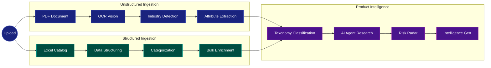

# Alchemy AI - Adaptive AI Product Intelligence Platform

Transforming messy, scattered industrial product catalogs and spec sheets into **trusted, explainable, and commerce-ready intelligence**.

---

## 🏗️ 9-Stage Intelligence Pipeline Architecture

Every document and bulk catalog upload passes through our deterministic, end-to-end AI pipeline. We do not rely on a single massive prompt; instead, we break the problem into 9 discrete, zero-shot AI stages.



### Stage Breakdown

1. **Ingestion & OCR (Vision)**: Parses PDFs and Images. If tables or scanned pages are detected, it routes them through our Vision models.
2. **Industry Detection**: Analyzes the raw text to detect the vertical (e.g., Electrical vs. Software), dynamically loading the correct extraction schema and validation rules.
3. **Attribute Extraction**: Schema-first extraction using `instructor`. Converts raw descriptions into validated JSON keys and values.
4. **Data Structuring (Excel)**: Normalizes bulk catalog uploads (up to thousands of rows) into a flat, predictable structure.
5. **Categorization**: Groups products into families and classes based on extracted attributes.
6. **Taxonomy**: Zero-shot taxonomy mapping, placing the product into an internal hierarchy (e.g., UNSPSC equivalents).
7. **AI Agent Research**: For critical missing attributes, an autonomous agent searches the web to find the missing specifications, appending them with a provenance confidence score.
8. **Risk Radar**: Runs industry-specific safety and compliance rules against the extracted data (e.g., flagging an outdoor electrical connector missing an IP rating).
9. **Intelligence Generation**: Aggregates the data into a final trusted record, generating an executive One-Pager and a commerce-ready JSON export.

---

## ⚡ Production-Level Latency & Cost Cutting

To build a production-grade system with minimal cloud costs, we engineered a **Two-Tier Inference Architecture**. 

### The Problem
Processing a 1000-row Excel catalog or a 50-page PDF using GPT-4o or Claude 3.5 Sonnet would cost hundreds of dollars in API credits and take hours due to restrictive rate limits.

### Our Solution
We achieved near-zero cost and sub-second latency per record by deploying a strategic mix of hyper-optimized Local LLMs and ultra-fast Cloud APIs.

1. **Local vLLM (Zero Cost, High Throughput)**
   - We deployed **vLLM** via WSL2 to serve models locally with OpenAI-compatible endpoints.
   - **Quantization:** We used 4-bit **AWQ** (Activation-aware Weight Quantization) models, allowing us to fit powerful 2B and 7B parameter models entirely within a standard 6GB/8GB consumer GPU (RTX 3050/4060).
   - **FlashInfer & PagedAttention:** Enabled continuous batching and FlashInfer samplers to process bulk extraction tasks with minimal memory overhead.

2. **Groq LPU (Zero Cost, Ultra-Low Latency)**
   - For complex structured JSON extraction (using `instructor`), we routed requests to **Groq**. 
   - Groq's LPU architecture provides ~800 tokens per second, allowing us to process bulk Excel rows in a fraction of a second.
   - **Rate Limit Throttling:** We built custom `MAX_WORKERS` semaphores and automatic exponential backoff (`tenacity`) to gracefully handle free-tier API limits without crashing the pipeline.

3. **Fallback Chaining**
   - Our `llm_client` implements silent fallback routing. If local vLLM runs out of memory on a massive context window, it seamlessly falls back to Groq. If Groq hits a rate limit, it pauses and retries natively.

---

## 🧠 Models Used

We selected specialized models for different stages of the pipeline to optimize for the exact task:

| Stage | Model Used | Why? |
|-------|------------|------|
| **Local Vision & OCR** | `Qwen/Qwen2-VL-2B-Instruct-AWQ` | Best-in-class open-source vision model. At 2B parameters with AWQ, it runs locally via vLLM on minimal VRAM while accurately parsing complex tables and engineering diagrams. |
| **Structured Extraction** | `groq/qwen/qwen3.6-27b` | Exceptional at following strict JSON schemas. Served via Groq for instantaneous attribute extraction across thousands of rows. |
| **Fallback & Reasoning** | `groq/llama-3.3-70b-versatile` | Heavy lifting for reasoning tasks (like the Risk Radar and Conflict Resolution) where deep logic is required. |
| **Embeddings & Vector Search** | `nomic-ai/nomic-embed-text-v1.5` | Fully local, open-source embedding model that outperforms OpenAI's ada-002 for matching similar products and taxonomy categories. |

---

## 🚀 Getting Started

Follow these steps to run the platform locally on your machine.

### 1. Start the Backend (FastAPI + AI Pipeline)

**Manual Setup (Windows PowerShell):**
Open a new terminal and navigate to the backend directory:
```powershell
cd DEV\backend
..\..\..\.venv\Scripts\activate
python -m uvicorn app.main:app --host 0.0.0.0 --port 6104 --reload
```

### 2. Start the Frontend (Next.js 14)

Open a new terminal and navigate to the frontend directory:
```bash
cd DEV/frontend
npm install
npm run dev
```
The frontend will be available at [http://localhost:3000](http://localhost:3000).

### 3. Start the Local AI Server (vLLM via WSL2)

```bash
# Inside WSL2 Ubuntu

```
Once the vLLM server is running, the backend will automatically connect to it for local extraction tasks!

---

## 🌐 Sharing the Platform Publicly (Pinggy SSH Tunnels)

To share the platform with others over the internet without deploying to the cloud, you can use secure SSH tunnels. This process requires 4 active terminal windows.

### Step 1: Start the Backend Server
In **Terminal 1**, start the FastAPI backend:
```bash
cd DEV/backend
python -m uvicorn app.main:app --host 127.0.0.1 --port 6104
```

### Step 2: Create a Public URL for the Backend
In **Terminal 2**, run the following SSH command to expose port 6104:
```bash
ssh -p 443 -R0:127.0.0.1:6104 a.pinggy.io
```
Copy the public URL generated by Pinggy (e.g., `https://random-string.free.pinggy.net`).

### Step 3: Update Frontend Config & Start
Open `DEV/frontend/.env` and update the API URL with the Pinggy link you just copied:
```env
NEXT_PUBLIC_API_URL=https://random-string.free.pinggy.net
```
Then, in **Terminal 3**, start the Next.js frontend:
```bash
cd DEV/frontend
npm run dev
```

### Step 4: Create a Public URL for the Frontend
In **Terminal 4**, expose the frontend (port 3000) so your friends can access the UI:
```bash
ssh -p 443 -R0:127.0.0.1:3000 a.pinggy.io
```
**Share this new frontend URL** with anyone you want. They will be able to access the full application securely over HTTPS.

> [!WARNING]
> Do not close any of these 4 terminals while sharing the link. If you close the SSH tunnel terminals, the public URLs will immediately go offline.
